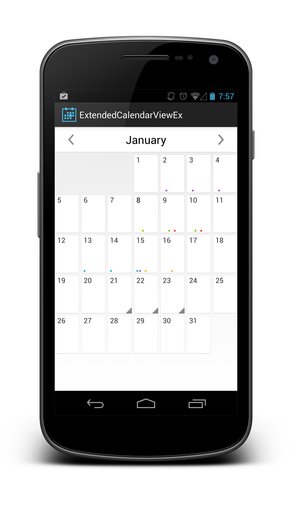

ExtendedCalendarView
====================

Currently there is no easy way of showing a calendar with the ability to display events on days, ExtendedCalendarView is meant to solve that problem.

Usage
=====

simply declare it in your layout

    <RelativeLayout xmlns:android="http://schemas.android.com/apk/res/android"
      android:layout_width="match_parent"
      android:layout_height="match_parent" >
    
    <com.tyczj.extendedcalendarview.ExtendedCalendarView 
        android:id="@+id/calendar"
        android:layout_height="match_parent"
        android:layout_width="match_parent"/>
    
    </RelativeLayout>
    
get the view like you normally would

    ExtendedCalendarView calendar = (ExtendedCalendarView)findViewById(R.id.calendar);

Calendar Content Provider
=========================

All events are stored in a content provider for easy access and the ability to have other app hook into your calendar if you choose. make sure you declare the content provider in your manifest

    <provider
        android:name="com.tyczj.extendedcalendarview.CalendarProvider"
        android:authorities="com.tyczj.extendedcalendarview.calendarprovider" />
                
if you dont want other apps to have access to your database make you add this attribute to the provider 
    
    android:permission="signature"    
    
Current database columns

    id - database id of the event
    event (Text) - name of the event
    location (Text) - where the event is
    description (Text) - information about the event
    start (Integer) - when the event starts
    end (Integer) - when the event ends
    start_day (Integer) - julian start day
    end_day (Integer) - julian end day
    color (Integer) - the color of the event

Adding Events
=============

To add an event to the content provider you need the start time, end time, julian start day and julian end day. For now you will have to implement your own way to get all the information but eventually in the future I may create one that you can just call and use.

    ContentValues values = new ContentValues();
		values.put(CalendarProvider.COLOR, Event.COLOR_RED);
		values.put(CalendarProvider.DESCRIPTION, "Some Description");
		values.put(CalendarProvider.LOCATION, "Some location);
		values.put(CalendarProvider.EVENT, "Event name);
			
		Calendar cal = Calendar.getInstance();
			
		cal.set(startDayYear, startDayMonth, startDayDay, startTimeHour, startTimeMin);
		values.put(CalendarProvider.START, cal.getTimeInMillis());
		values.put(CalendarProvider.START_DAY, julianDay);
		TimeZone tz = TimeZone.getDefault();
			
		cal.set(endDayYear, endDayMonth, endDayDay, endTimeHour, endTimeMin);
		int endDayJulian = Time.getJulianDay(cal.getTimeInMillis(), TimeUnit.MILLISECONDS.toSeconds(tz.getOffset(cal.getTimeInMillis())));
			
		values.put(CalendarProvider.END, cal.getTimeInMillis());
		values.put(CalendarProvider.END_DAY, endDayJulian);

		Uri uri = getContentResolver().insert(CalendarProvider.CONTENT_URI, values);
		
julian start day is generated for you when the month is built so all you would have to do it call day.getStartDay() on the day and it will give you the julian day
